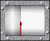

# Visor para el datalogger de un sismómetro:

El proyecto consiste de un sistema de digitalización, almacenamiento y visualización de datos proveniente de un sismómetro tipo SM-6. Se estudió e implementó el diseño del preamplificador presentado por **Havskov & Alguacil (2006)**, y se agregó un sistema de acondicionamiento y filtrado de los datos compuestos por celdas tipo Sallen Key (un filtro pasa bajo y un pasa altos). La base teórica del sistema datalogger, está documentada y explicada en el artículo anexo al proyecto: [El Sensor Sísmico Geófono](http://tecnologiacumanesa.blogspot.com/2015/05/el-sensor-sismico-geofono.html); publicada en el blog del autor.

<table class="default">
  <tr>
    <td></td>
     <td></td>
    <td></td>
    <td></td>
    <td></td>
  </tr>
</table>

La digitalización de los datos se realizó mediante una tarjeta de desarrollo PICDEMZ de la compañía [Microchip](https://www.microchip.com/); que tiene incorporado un PIC 18F25K20. Para desarrollar el software referente al PIC, se utilizó [MPLAB ®](https://www.microchip.com/en-us/development-tools-tools-and-software/mplab-x-ide) entorno X de desarrollo integrado (IDE) de Microchip y el compilador de lenguaje [CCS](http://www.ccsinfo.com/content.php?page=compilers) de Custom Computer Services, Inc. Para almacenar y graficar los datos en un PC vía el puerto serial, se desarrolló una aplicación codificada en [Processing](https://processing.org/) (The Processing Fundation); implementando un conjunto de 8 script. 

El prototipo fue construido para participar en la Feria de Ciencias Regional Oriente 2015, convocada en Cumaná (Edo. Sucre., Venezuela).
