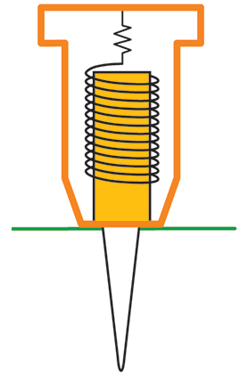
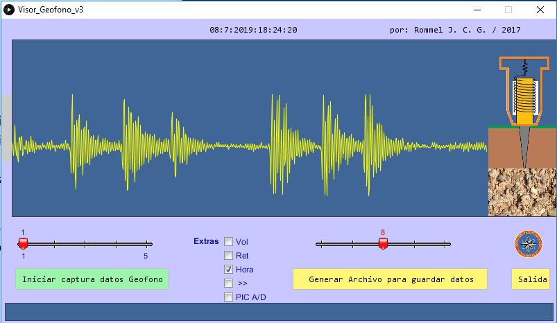

# Visor para el datalogger de un sismómetro:

El proyecto consiste de un sistema de digitalización, almacenamiento y visualización de datos proveniente de un sismómetro tipo SM-6. Se estudió e implementó el diseño del preamplificador presentado por **Havskov & Alguacil (2006)**, y se agregó un sistema de acondicionamiento y filtrado de los datos compuestos por celdas tipo Sallen Key (un filtro pasa bajo y un pasa altos). La base teórica del sistema datalogger, está documentada y explicada en el artículo anexo al proyecto: [El Sensor Sísmico Geófono](http://tecnologiacumanesa.blogspot.com/2015/05/el-sensor-sismico-geofono.html); publicada en el blog del autor.

Un sensor sísmico es un instrumento para medir el movimiento del suelo cuando su estabilidad ha sido perturbada. El sensor sísmico (sismómetro o geófono) debe suministrar una variable física cinemática relacionada con el movimiento del suelo (desplazamiento, velocidad o aceleración).

<table class="default">
  <tr>
    <td></td>
     <td></td>
    <td></td>
    <td></td>
    <td></td>
  </tr>
</table>

Los sismólogos prefieren monitorear los débiles movimientos de desplazamientos o las pequeñas velocidades que adquieren las partículas en movimiento para facilitarse la interpretación de las fases sísmicas (utilizando sismómetros; que son más grandes que los geófonos), mientras que los ingenieros utilizan las fuertes indicaciones asociadas a la aceleración (mediante geófonos), cuyos valores picos están directamente relacionados con el diseño y estabilidad de las estructuras. Los sistemas de conversión análogo/digital (A/D) y el consecuente almacenamiento digital de los datos, hacen posible ejecutar con rapidez las rutinas de cálculo y filtrado para la conversión de esos datos en el parámetro específico que se requiera (aceleración, velocidad, o desplazamiento).

La digitalización de los datos se realizó mediante una tarjeta de desarrollo PICDEMZ de la compañía [Microchip](https://www.microchip.com/); que tiene incorporado un PIC 18F25K20. Para desarrollar el software referente al PIC, se utilizó [MPLAB ®](https://www.microchip.com/en-us/development-tools-tools-and-software/mplab-x-ide) entorno X de desarrollo integrado (IDE) de Microchip y el compilador de lenguaje [CCS](http://www.ccsinfo.com/content.php?page=compilers) de Custom Computer Services, Inc. Para almacenar y graficar los datos en un PC vía el puerto serial, se desarrolló una aplicación codificada en [Processing](https://processing.org/) (The Processing Foundation); implementando un conjunto de 8 script. 
